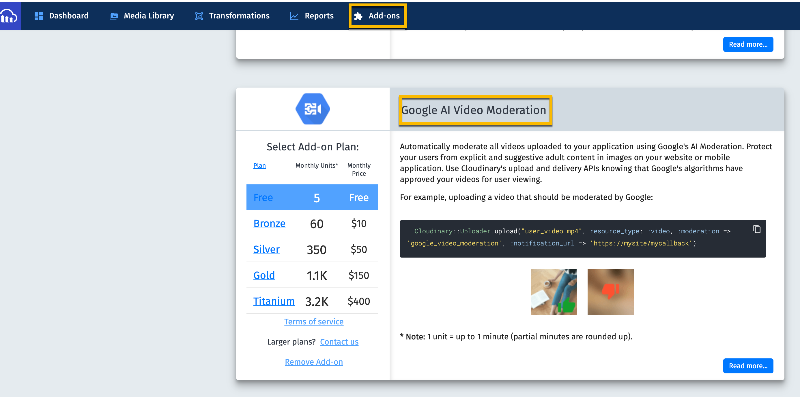
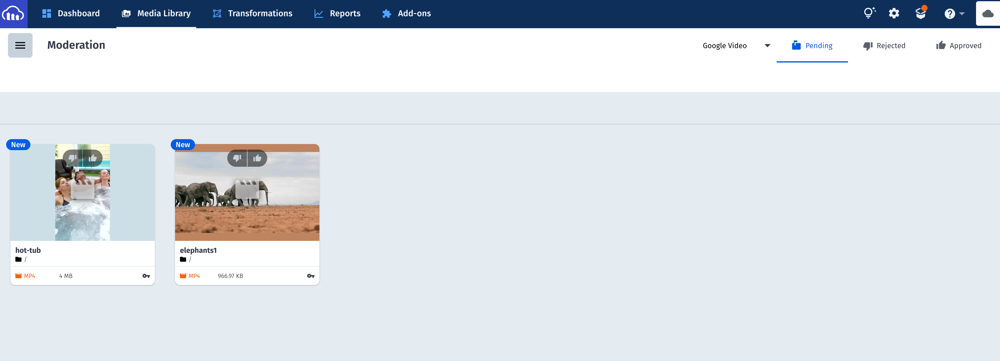

# Moderation Workflow

This is a scenario in which you are allowing your users to upload video.  You want to moderate the video 
before it is made public. You don't want there to be any time where the video could be accessed and cached before it has been approved by Google Moderation.  There is a period between the time when the video is uploaded and google moderation is complete.  Once moderation processing is complete, a webhook can be used to notify or trigger further action.

We're using an Cloudinary Add-on called Google AI Video Moderation.  You can find this in your console under addons. Even on a free account you will have access to free calls to this add on in the upload API. 
 

We upload the video with type `upload` which is public, but we also add `access_control: [{ access_type: 'token' }]` so that no one can access the original video or create and derived videos until moderation is complete and the video has been approved. 

We're using webhooks to let us know when the processing is complete.  After is it completed, we can check the `moderation_status`.   
It will be `approved` or `rejected`.  This will put it into either the approved or rejected queue.  

For this exercise, we have two videos.  A video with a hot tub will be rejected and a video with elephants walking will be accepted.  
We're going to make both of these videos inaccessible on upload using the `access_control` option with `access_type: 'token'`.  

The webhook is be called when moderation is complete and the video has been put into the accepted or rejected queue of Google Video Moderation.  You can see the videos in the Google moderation pending queue in the DAM.  In our webhook,
there is a 60 second sleep function called by the functions that check the appending and approved Q's. This is for demo purposes. It gives you time to look at the Google Video Moderation pending queue.



```JavaScript
cloudinary.uploader
  .upload('./assets/video/hot-tub.mp4', {
    resource_type: 'video',
    public_id: 'hot-tub',
    access_control: [{ access_type: 'token' }],
    moderation: 'google_video_moderation:possible',
    notification_url:
      '<WEBHOOK URL>'
  })

cloudinary.uploader
  .upload('https://res.cloudinary.com/cloudinary-training/video/upload/v1588613988/elephants.mp4', {
    resource_type: 'video',
    public_id: 'elephants1',
    access_control: [{ access_type: 'token' }],
    moderation: 'google_video_moderation:possible',
    notification_url:
      'https://rpeltz-webhook-processing.netlify.app/.netlify/functions/webhook_clear_google_moderation_approved_queue'
  })
```
When the webhook has finished processing, we expect the elephant video to be public and in the approved queue.  The hot tub video will have been deleted, because our code deletes every video it finds in the rejected queue. 

### Making approved videos public

All the videos have the delivery type `public`, and what's restricting them is the `access_type: 'token'`.  All we need to do to make them accessible is to change the `access_type` to `anonymous`.  First we get the list of approved videos and then we use the Admin API `update` to change the access_control.

```JavaScript
 const approvedQ = await cloudinary.api.resources_by_moderation(
      'google_video_moderation',
      'approved',
      {
        resource_type: 'video',
      }
    );
const updateResponse = await cloudinary.api.update(video.public_id, {
      resource_type: 'video',
      access_control: [{ access_type: 'anonymous' }],
      invalidate: true,
    });
```

### Deleting videos in the rejected queue

We'll use the Upload API destroy method to remove any videos in the rejected queue. We get the list of videos in the rejected queue and then we iterate through it deleting all rejected videos found in queue.

## Deploying Webhook functions to Netlify

Install node/npm on Mac with Homebrew

```bash
/usr/bin/ruby -e "$(curl -fsSL https://raw.githubusercontent.com/
Homebrew/install/master/install)"
brew update
brew install node
```


I'm using `yarn` which you can install using npm `npm install --global yarn`.  The yarn build command is `yarn build`.

You can use `npm`.  The NPM build command is `npm run build`.

You can deploy async functions to netlify.  There are many options available for doing this.

If you fork this repository or copy the functions in the `/functions` directory to your own repository, you can deploy them to Netlify by including a `netlify.toml` file in your root with the following information for building and specifying where to find the functions directory.

```toml
[build]
  command = "yarn build"
  functions = "functions/"
```

Push your repository to GitHub (or GitLab or Bitbucket).
Set up a free account in Netlify.
Create a new site and indicate you want to `Import an existing template` and locate your repository with permission to deploy.

### Setup Environment Variables in Netlify 


